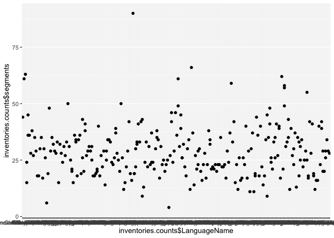
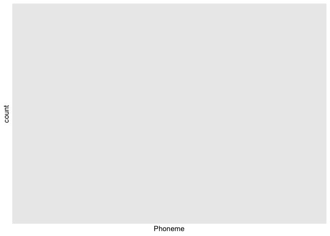
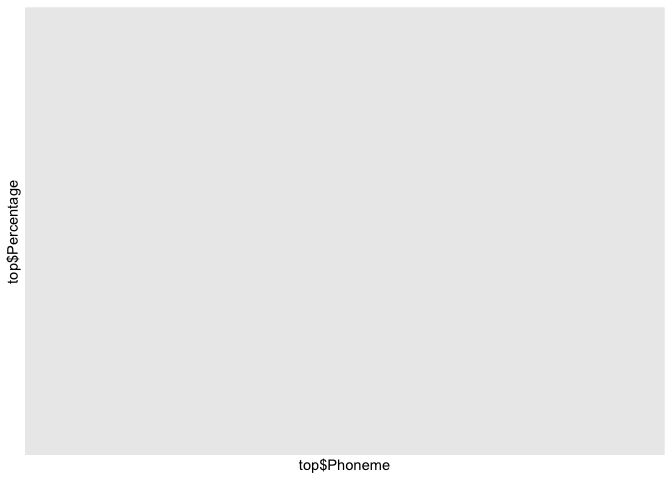
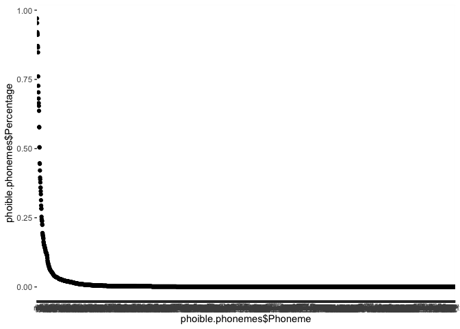
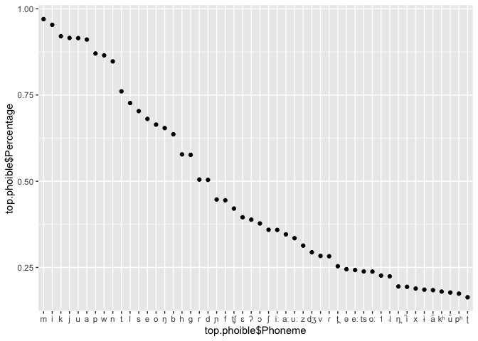
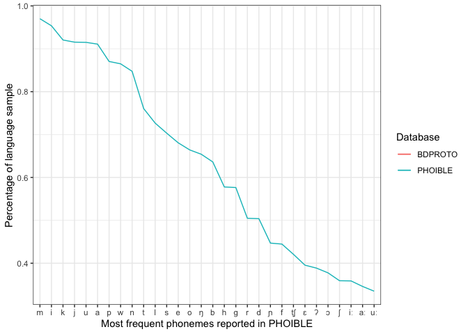
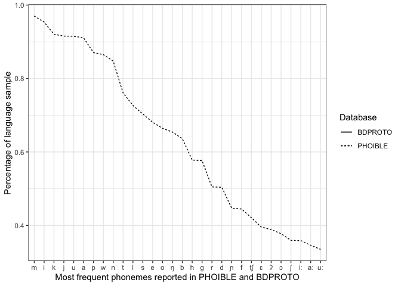
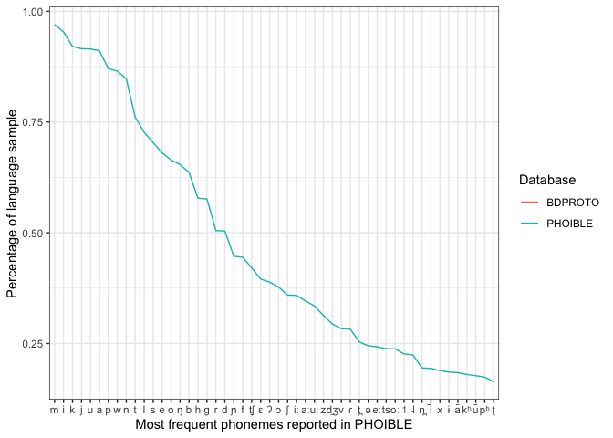

BDPROTO descriptive stats
================
Steven Moran

15 April, 2022

Some preliminary descriptive stats about the current BDPROTO data.

``` r
library(tidyverse)
library(knitr)
```

Load BDPROTO data

``` r
inventories <- read_csv('../../bdproto.csv')
```

    ## Rows: 7880 Columns: 31
    ## ── Column specification ────────────────────────────────────────────────────────
    ## Delimiter: ","
    ## chr (25): SourceLanguageName, SourceLanguageFamily, Phoneme, PhonemeNotes, A...
    ## dbl  (4): BdprotoID, TimeDepthYBP, HomelandLatitude, HomelandLongitude
    ## lgl  (2): LowconfidencePhonemic, LowconfidencePhonetic
    ## 
    ## ℹ Use `spec()` to retrieve the full column specification for this data.
    ## ℹ Specify the column types or set `show_col_types = FALSE` to quiet this message.

Display a subset of the data.

``` r
kable(inventories %>% select(BdprotoID, LanguageName, Glottocode, Phoneme, LanguageFamily, TimeDepthYBP) %>% arrange(BdprotoID)) %>% head()
```

    ## [1] "| BdprotoID|LanguageName                     |Glottocode |Phoneme |LanguageFamily           | TimeDepthYBP|"
    ## [2] "|---------:|:--------------------------------|:----------|:-------|:------------------------|------------:|"
    ## [3] "|         3|Proto-Balto-Slavic               |balt1263   |m       |Balto-Slavic             |         3000|"
    ## [4] "|         3|Proto-Balto-Slavic               |balt1263   |p       |Balto-Slavic             |         3000|"
    ## [5] "|         3|Proto-Balto-Slavic               |balt1263   |b       |Balto-Slavic             |         3000|"
    ## [6] "|         3|Proto-Balto-Slavic               |balt1263   |w       |Balto-Slavic             |         3000|"

How many total inventories are there? Note: contains duplicate
languages!

``` r
nrow(inventories %>% select(BdprotoID) %>% unique())
```

    ## [1] 272

How many data points are there per input data source?

``` r
sources <- inventories %>% select(BdprotoID, LanguageName, Source) %>% 
  group_by(BdprotoID, LanguageName, Source) %>% distinct()
table(sources$Source)
```

    ## 
    ##     ANE BDPROTO    HUJI      UZ 
    ##      21     101     138      12

How many unique phonemes are there in total?

``` r
nrow(inventories %>% select(Phoneme) %>% group_by(Phoneme) %>% distinct())
```

    ## [1] 681

How many language families are there?

``` r
nrow(inventories %>% select(LanguageFamily) %>% group_by(LanguageFamily) %>% distinct())
```

    ## [1] 164

What are they?

``` r
table(inventories %>% select(LanguageFamily) %>% group_by(LanguageFamily) %>% distinct())
```

    ## 
    ##             Afro-Asiatic                     Ainu                 Albanian 
    ##                        1                        1                        1 
    ##                    Aleut                    Algic              Alor-Pantar 
    ##                        1                        1                        1 
    ##                   Altaic                Anatolian                     Anim 
    ##                        1                        1                        1 
    ##                 Arawakan                 Armenian                   Aslian 
    ##                        1                        1                        1 
    ##            Asmat-Awyu-Ok               Athabaskan               Australian 
    ##                        1                        1                        1 
    ##            Austroasiatic             Austronesian                  Aymaran 
    ##                        1                        1                        1 
    ##             Balto-Slavic                  Bantoid                   Baraic 
    ##                        1                        1                        1 
    ##                Barbacoan                   Basque                   Berber 
    ##                        1                        1                        1 
    ##                    Boran             Bulaka River           Burmo-Quiangic 
    ##                        1                        1                        1 
    ##                  Caddoan                   Celtic                   Chadic 
    ##                        1                        1                        1 
    ##                 Cherokee                 Chibchan                Chimakuan 
    ##                        1                        1                        1 
    ##              Chinantecan       Chukchi-Kamchatkan                Costanoan 
    ##                        1                        1                        1 
    ##                 Cushitic                Dravidian               East Timor 
    ##                        1                        1                        1 
    ##         East Timor-Bunaq                 Egyptian                  Elamian 
    ##                        1                        1                        1 
    ##                   Eskimo             Eskimo-Aleut                   Finnic 
    ##                        1                        1                        1 
    ##       Gbaya-Manza-Ngbaka                 Germanic          Graeco-Phrygian 
    ##                        1                        1                        1 
    ##                Guahiboan                  Guianan              Gunwinyguan 
    ##                        1                        1                        1 
    ##                      Gur                  Hattian               Himalayish 
    ##                        1                        1                        1 
    ##                    Hlaic                  Huavean           Hurro-Urartian 
    ##                        1                        1                        1 
    ##                      Ijo            Indo-European             Indo-Iranian 
    ##                        1                        1                        1 
    ##     Inland Gulf of Papua                  Iranian                Iroquoian 
    ##                        1                        1                        1 
    ##                   Italic                 Iwaidjan                   Jabuti 
    ##                        1                        1                        1 
    ##                  Japonic                       Je                   Kadaic 
    ##                        1                        1                        1 
    ##          Kainantu-Goroka                  Kam-Tai                  Karenic 
    ##                        1                        1                        1 
    ##               Kartvelian                  Kassian                   Katuic 
    ##                        1                        1                        1 
    ##                  Keresan                 Khantyic                     Khoe 
    ##                        1                        1                        1 
    ##             Kiowa-Tanoan                 Koiarian                  Koiaric 
    ##                        1                        1                        1 
    ##                    Koman           Kuki-Chin-Naga          Kwa Volta-Congo 
    ##                        1                        1                        1 
    ##              Lakes Plain              Lakkia-Biao             Lolo-Burmese 
    ##                        1                        1                        1 
    ##              Lower Sepik                    Maban                  Maiduan 
    ##                        1                        1                        1 
    ##        Malayo-Polynesian                    Mande                   Mansic 
    ##                        1                        1                        1 
    ##       Marind-Boazi-Yaqai           Maweti-Guarani                    Mayan 
    ##                        1                        1                        1 
    ##              Micronesian          Miwok-Costanoan                  Miwokan 
    ##                        1                        1                        1 
    ##                   Mixtec                 Mongolic                    Monic 
    ##                        1                        1                        1 
    ##                 Mundaric                Muskogean                Nicobaric 
    ##                        1                        1                        1 
    ##             Nilo-Saharan                  Nilotic          North Halmahera 
    ##                        1                        1                        1 
    ##       Northern Iroquoian                Nostratic                   Nubian 
    ##                        1                        1                        1 
    ##         Nuclear Sentanic Nuclear Trans New Guinea               Nyulnyulan 
    ##                        1                        1                        1 
    ##                 Ob-Ugric              Otomanguean                  Otomian 
    ##                        1                        1                        1 
    ##              Palaihnihan             Pama-Nyungan                    Paman 
    ##                        1                        1                        1 
    ##               Paulaungic                   Pearic                  Permian 
    ##                        1                        1                        1 
    ##                   Pomoan      Popolocan-Mazatecan                 Quechuan 
    ##                        1                        1                        1 
    ##          Quichean-Mamean                   Saamic                 Salishan 
    ##                        1                        1                        1 
    ##                Samoyedic       Sara-Bongo-Bagirmi                  Semitic 
    ##                        1                        1                        1 
    ##                  Sinitic                   Siouan         Skou-Serra-Piore 
    ##                        1                        1                        1 
    ##  South-West Pama-Nyungan                 Sumerian                  Tacanan 
    ##                        1                        1                        1 
    ##                 Takelman                   Tariku                 Teluguic 
    ##                        1                        1                        1 
    ##            Tibeto-Burman        Timor-Alor-Pantar                    Tirio 
    ##                        1                        1                        1 
    ##        Tlapanec-Manguean                Tokharian                      Tol 
    ##                        1                        1                        1 
    ##                Totonacan              Totozoquean                Tsimshian 
    ##                        1                        1                        1 
    ##                 Tucanoan             Tupi-Guarani                   Turkic 
    ##                        1                        1                        1 
    ##                   Uralic           Uralo-Siberian              Uto-Aztecan 
    ##                        1                        1                        1 
    ##                   Vietic              Volta-Congo   Waikuruan (Guaicuruan) 
    ##                        1                        1                        1 
    ##                  Wintuan                Worrorran                 Yokutsan 
    ##                        1                        1                        1 
    ##                Zapotecan                    Zoque 
    ##                        1                        1

How many distinct Glottocodes are there?

``` r
bdproto.glottocodes <- inventories %>% select(Glottocode) %>% filter(!is.na(Glottocode)) %>% unique()
nrow(bdproto.glottocodes)
```

    ## [1] 214

Some are NA because they don’t exist in the Glottolog, e.g. Altaic.

``` r
# inventories %>% group_by(BdprotoID, Glottocode) %>% select(BdprotoID, Glottocode) %>% distinct() %>% filter(n()<1)
temp <- as.data.frame(inventories %>% select(BdprotoID, Glottocode) %>% distinct())
table(temp$Glottocode=="") # 22
```

    ## 
    ## FALSE 
    ##   256

``` r
table(temp$Glottocode=="", exclude=F) # 11 NA
```

    ## 
    ## <NA> 
    ##   16

Get the Glottolog family IDs.

``` r
glottolog <- read.csv('../../src/glottolog_languoid.csv/languoid.csv', header=T, stringsAsFactors = F)
glottlog.families <- glottolog %>% select(family_id) %>% distinct()
```

How many BDPROTO Glottocodes are in the Glottolog top-level language
family trees?

``` r
table(bdproto.glottocodes$Glottocode %in% glottlog.families$family_id)
```

    ## 
    ## FALSE  TRUE 
    ##   154    60

Which ones?

``` r
kable(bdproto.glottocodes[which(bdproto.glottocodes$Glottocode %in% glottlog.families$family_id), ])
```

| Glottocode |
|:-----------|
| afro1255   |
| araw1281   |
| aust1307   |
| chib1249   |
| chim1311   |
| chuk1271   |
| drav1251   |
| eski1264   |
| guah1252   |
| ijoi1239   |
| indo1319   |
| kart1248   |
| kere1287   |
| lake1255   |
| lowe1437   |
| maid1262   |
| mand1469   |
| maya1287   |
| otom1299   |
| basq1248   |
| maba1274   |
| nubi1251   |
| pomo1273   |
| sali1255   |
| taik1256   |
| toto1251   |
| tuca1253   |
| ural1272   |
| utoa1244   |
| yoku1255   |
| turk1311   |
| aust1305   |
| iroq1247   |
| timo1261   |
| nort2923   |
| nucl1709   |
| cadd1255   |
| quec1387   |
| ayma1253   |
| barb1265   |
| nilo1247   |
| nucl1710   |
| mixe1284   |
| jica1245   |
| tsim1258   |
| siou1252   |
| pama1250   |
| guai1249   |
| miwo1274   |
| musk1252   |
| huav1256   |
| pala1350   |
| iwai1246   |
| nyul1248   |
| koma1264   |
| gunw1250   |
| anim1240   |
| bula1259   |
| koia1260   |
| worr1236   |

How many segments do the proto-languages have? (Note some inventories
only have consonant or vowel inventories specified, so we filter by the
`InventoryType` field.)

``` r
inventories.counts <- inventories %>% select(BdprotoID, LanguageName, InventoryType) %>% group_by(BdprotoID, LanguageName, InventoryType) %>% summarize(segments=n()) %>% arrange(segments)
```

    ## `summarise()` has grouped output by 'BdprotoID', 'LanguageName'. You can
    ## override using the `.groups` argument.

``` r
dim(inventories.counts)
```

    ## [1] 272   4

Drop consonant and vowel only inventories (currently 10 data points)

``` r
inventories.counts.cs.vs <- inventories.counts %>% filter(is.na(InventoryType))
dim(inventories.counts.cs.vs)
```

    ## [1] 0 4

What is the median and mean number of segments in the sample (for full
consonant and vowel inventories)?

``` r
summary(inventories.counts.cs.vs$segments)
```

    ##    Min. 1st Qu.  Median    Mean 3rd Qu.    Max. 
    ## 

All segment types.

``` r
# TODO: fix the NAs in the input data
table(inventories$InventoryType, exclude=F)
```

    ## 
    ##             all consonants only     vowels only 
    ##            7003             835              42

Get consonant counts and stats of ALL inventories.

``` r
inventories.consonants <- inventories %>% filter(is.na(InventoryType) | InventoryType=="consonants only") %>% filter(Source!="ANE") 
table(inventories.consonants$InventoryType, exclude=F)
```

    ## 
    ## consonants only 
    ##             835

Get the consonant counts per inventory (252 data points).

``` r
c.counts <- inventories.consonants %>% select(BdprotoID, Phoneme, InventoryType) %>% filter(InventoryType=="consonants only") %>% group_by(BdprotoID) %>% summarize(consonants = n())
summary(c.counts$consonants)
```

    ##    Min. 1st Qu.  Median    Mean 3rd Qu.    Max. 
    ##   11.00   16.00   21.00   21.97   26.00   45.00

Get consonant counts and stats of original BDPROTO (one data point per
genealogical unit).

``` r
og.bdproto.cs <- inventories %>% filter(is.na(InventoryType) | InventoryType=="consonants only") %>% filter(Source=="BDPROTO")
```

Get the consonant counts per inventory (252 data points).

``` r
og.c.counts <- og.bdproto.cs %>% select(BdprotoID, Phoneme, InventoryType) %>% filter(InventoryType=="consonants only") %>% group_by(BdprotoID) %>% summarize(consonants = n())
summary(og.c.counts$consonants)
```

    ##    Min. 1st Qu.  Median    Mean 3rd Qu.    Max. 
    ##   14.00   19.00   21.00   22.75   28.25   33.00

Get vowel counts and stats of ALL inventories.

``` r
inventories.vowels <- inventories %>% filter(is.na(InventoryType) | InventoryType=="vowels only") %>% filter(Source!="ANE")
table(inventories.vowels$InventoryType, exclude=F)
```

    ## 
    ## vowels only 
    ##          42

Get the vowel counts per inventory (should be 252 data points).

``` r
v.counts <- inventories.vowels %>% select(BdprotoID, Phoneme, InventoryType) %>% filter(InventoryType=="vowels only") %>% group_by(BdprotoID) %>% summarize(vowels = n())
summary(v.counts$vowels)
```

    ##    Min. 1st Qu.  Median    Mean 3rd Qu.    Max. 
    ##     4.0     6.0     9.0     8.4     9.0    14.0

Get vowel counts and stats of original BDPROTO (one data point per
genealogical unit).

``` r
og.bdproto.vs <- inventories %>% filter(is.na(InventoryType) | InventoryType=="vowels only") %>% filter(Source=="BDPROTO")
```

Get the consonant counts per inventory (252 data points).

``` r
og.v.counts <- og.bdproto.vs %>% select(BdprotoID, Phoneme, InventoryType) %>% filter(InventoryType=="vowels only") %>% group_by(BdprotoID) %>% summarize(vowels = n())
summary(og.v.counts$vowels)
```

    ##    Min. 1st Qu.  Median    Mean 3rd Qu.    Max. 
    ##     4.0     6.0     9.0     8.4     9.0    14.0

Plot segment counts (all inventories).

``` r
inventories.counts$BdprotoID <- factor(inventories.counts$BdprotoID, levels=inventories.counts$BdprotoID[order(-inventories.counts$segments)])
qplot(inventories.counts$LanguageName, inventories.counts$segments)
```

<!-- -->

What is the frequency of segments across the proto-languages? Use only
inventories that have both consonant and vowel descriptions.

``` r
inventories.cs.vs <- inventories %>% filter(is.na(InventoryType))
segment.counts <- inventories.cs.vs %>% select(Phoneme) %>% group_by(Phoneme) %>% summarize(count=n()) %>% arrange(desc(count)) %>% filter(!is.na(Phoneme))
dim(segment.counts)
```

    ## [1] 0 2

``` r
head(segment.counts)
```

    ## # A tibble: 0 × 2
    ## # … with 2 variables: Phoneme <chr>, count <int>

Get percentages.

``` r
total.inventories <- nrow(inventories.cs.vs %>% select(BdprotoID) %>% distinct())
segment.counts$Percentage <- segment.counts$count/total.inventories
```

Plot it.

``` r
segment.counts$Phoneme <- factor(segment.counts$Phoneme, levels=segment.counts$Phoneme[order(-segment.counts$count)])
ggplot(segment.counts, aes(x=Phoneme, y=count))+
geom_point() + 
ylab('count') +
xlab('Phoneme')
```

<!-- -->

Plot just the top 50 most frequent segments.

``` r
top <- head(segment.counts, n=50)
# qplot(top$Phoneme, top$count)
qplot(top$Phoneme, top$Percentage)
```

<!-- -->

Get phoible phonemes for comparison.

``` r
phoible <- read_csv('https://raw.githubusercontent.com/phoible/dev/master/data/phoible.csv')
```

    ## Rows: 105488 Columns: 48
    ## ── Column specification ────────────────────────────────────────────────────────
    ## Delimiter: ","
    ## chr (46): Glottocode, ISO6393, LanguageName, SpecificDialect, GlyphID, Phone...
    ## dbl  (1): InventoryID
    ## lgl  (1): Marginal
    ## 
    ## ℹ Use `spec()` to retrieve the full column specification for this data.
    ## ℹ Specify the column types or set `show_col_types = FALSE` to quiet this message.

``` r
# PHOIBLE inventories are not unique (3020)
num.phoible.inventories <- nrow(phoible %>% select(InventoryID) %>% distinct())

# Get number of unique inventories by Glottocode (2185)
num.phoible.inventories <- nrow(phoible %>% select(Glottocode) %>% distinct())

# Get phoneme counts and percentages
phoible.phonemes <- phoible %>% select(Glottocode, Phoneme) %>% group_by(Glottocode) %>% distinct() %>% group_by(Phoneme) %>% summarize(count=n()) %>% arrange(desc(count))

phoible.phonemes$Percentage <- phoible.phonemes$count/num.phoible.inventories
head(phoible.phonemes)
```

    ## # A tibble: 6 × 3
    ##   Phoneme count Percentage
    ##   <chr>   <int>      <dbl>
    ## 1 m        2112      0.970
    ## 2 i        2076      0.954
    ## 3 k        2004      0.921
    ## 4 j        1993      0.915
    ## 5 u        1992      0.915
    ## 6 a        1983      0.911

``` r
phoible.phonemes$Phoneme <- factor(phoible.phonemes$Phoneme, levels=phoible.phonemes$Phoneme[order(-phoible.phonemes$count)])
```

Segment counts (disregards genealogical relatedness and areal
proximity).

``` r
phoible.counts <- phoible %>% select(InventoryID, Phoneme, SegmentClass) %>% group_by(InventoryID) %>% summarize(segments=n())
summary(phoible.counts$segments)
```

    ##    Min. 1st Qu.  Median    Mean 3rd Qu.    Max. 
    ##   11.00   25.00   33.00   34.93   42.00  161.00

Consonant counts (disregards genealogical relatedness and areal
proximity).

``` r
phoible.cs <- phoible %>% select(InventoryID, Phoneme, SegmentClass) %>% filter(SegmentClass == "consonant") %>% group_by(InventoryID) %>% summarize(segments=n())
summary(phoible.cs$segments)
```

    ##    Min. 1st Qu.  Median    Mean 3rd Qu.    Max. 
    ##    6.00   17.00   22.00   23.93   28.00  130.00

Vowel counts (disregards genealogical relatedness and areal proximity).

``` r
phoible.vs <- phoible %>% select(InventoryID, Phoneme, SegmentClass) %>% filter(SegmentClass == "vowel") %>% group_by(InventoryID) %>% summarize(segments=n())
summary(phoible.vs$segments)
```

    ##    Min. 1st Qu.  Median    Mean 3rd Qu.    Max. 
    ##    2.00    6.00    9.00   10.28   13.00   50.00

Tone counts (disregards genealogical relatedness and areal proximity).

``` r
phoible.ts <- phoible %>% select(InventoryID, Phoneme, SegmentClass) %>% filter(SegmentClass == "tone") %>% group_by(InventoryID) %>% summarize(segments=n())
summary(phoible.ts$segments)
```

    ##    Min. 1st Qu.  Median    Mean 3rd Qu.    Max. 
    ##   1.000   2.000   3.000   3.381   4.000  10.000

Frequency distribution of phonemes in phoible.

``` r
qplot(phoible.phonemes$Phoneme, phoible.phonemes$Percentage)
```

<!-- -->

Frequency distribution of 50 most frequent phonemes in phoible.

``` r
top.phoible <- head(phoible.phonemes, n=50)
qplot(top.phoible$Phoneme, top.phoible$Percentage)
```

<!-- -->

Combine the phoneme counts to plot them together in one graph.

``` r
x <- phoible.phonemes
colnames(x) <- c("Phoneme", "Phoible.count", "Phoible.percentage")
y <- segment.counts
colnames(y) <- c("Phoneme", "Bdproto.count", "Bdproto.percentage")
z <- left_join(x,y)
```

    ## Joining, by = "Phoneme"

``` r
rm(x,y)

# Reorder phonemes as factor
z$Phoneme <- factor(z$Phoneme, levels=z$Phoneme[order(-z$Phoible.count)])
```

Try top 30 phonemes.

``` r
top.z <- head(z, n=30)

ggplot(data = top.z, aes(x = Phoneme, group=1)) +
  geom_line(aes(y = Phoible.percentage, color = "PHOIBLE")) + 
  geom_line(aes(y = Bdproto.percentage, color = "BDPROTO")) +
  ylab("Percentage of language sample") +
  xlab("Most frequent phonemes reported in PHOIBLE") +
  labs(color="Database") +
  theme_bw()
```

    ## Warning: Removed 30 row(s) containing missing values (geom_path).

<!-- -->

Try top 30 phonemes without color.

``` r
top.z <- head(z, n=30)

ggplot(data = top.z, aes(x = Phoneme, group=1)) +
  geom_line(aes(y = Bdproto.percentage, linetype = "BDPROTO")) +
  geom_line(aes(y = Phoible.percentage, linetype = "PHOIBLE")) + 
  ylab("Percentage of language sample") +
  xlab("Most frequent phonemes reported in PHOIBLE and BDPROTO") +
  labs(linetype="Database") +
  theme_bw()
```

    ## Warning: Removed 30 row(s) containing missing values (geom_path).

<!-- -->

Try top 50 phonemes.

``` r
top.z <- head(z, n=50)

# Some phonemes occur very rarely in BDPROTO (or not at all) compared to PHOIBLE, e.g. /ts/ occurs at 2.5%. High tone not at all.
top.z %>% filter(Phoneme=="ts")
```

    ## # A tibble: 1 × 5
    ##   Phoneme Phoible.count Phoible.percentage Bdproto.count Bdproto.percentage
    ##   <fct>           <int>              <dbl>         <int>              <dbl>
    ## 1 ts                519              0.238            NA                 NA

``` r
top.z %>% filter(Phoneme=="˦")
```

    ## # A tibble: 1 × 5
    ##   Phoneme Phoible.count Phoible.percentage Bdproto.count Bdproto.percentage
    ##   <fct>           <int>              <dbl>         <int>              <dbl>
    ## 1 ˦                 493              0.226            NA                 NA

``` r
ggplot(data = top.z, aes(x = Phoneme, group=1)) +
  geom_line(aes(y = Phoible.percentage, color = "PHOIBLE")) + 
  geom_line(aes(y = Bdproto.percentage, color = "BDPROTO")) +
  ylab("Percentage of language sample") +
  xlab("Most frequent phonemes reported in PHOIBLE") +
  labs(color="Database") +
  theme_bw()
```

    ## Warning: Removed 50 row(s) containing missing values (geom_path).

<!-- -->

Get dates.

``` r
inventories.dates <- inventories.cs.vs %>% select(BdprotoID, LanguageName, LanguageFamily, TimeDepthYBP) %>% group_by(BdprotoID, LanguageName, LanguageFamily, TimeDepthYBP) %>% distinct() %>% arrange(desc(TimeDepthYBP)) %>% filter(TimeDepthYBP < 10001)
head(inventories.dates)
```

    ## # A tibble: 0 × 4
    ## # Groups:   BdprotoID, LanguageName, LanguageFamily, TimeDepthYBP [0]
    ## # … with 4 variables: BdprotoID <dbl>, LanguageName <chr>,
    ## #   LanguageFamily <chr>, TimeDepthYBP <dbl>

Get coverage by Glottolog macroarea.

``` r
# Get the geo/genealogical data from Glottolog
geo <- read.csv(url("https://cdstar.shh.mpg.de/bitstreams/EAEA0-E7DE-FA06-8817-0/languages_and_dialects_geo.csv"), stringsAsFactors = FALSE)

# Merge with the BDPROTO data points
temp <- left_join(bdproto.glottocodes, geo, by=c("Glottocode"="glottocode"))
head(temp)
```

    ## # A tibble: 6 × 7
    ##   Glottocode name  isocodes level   macroarea latitude longitude
    ##   <chr>      <chr> <chr>    <chr>   <chr>        <dbl>     <dbl>
    ## 1 afro1255   <NA>   <NA>    <NA>     <NA>           NA        NA
    ## 2 algo1256   <NA>   <NA>    <NA>     <NA>           NA        NA
    ## 3 anat1257   <NA>   <NA>    <NA>     <NA>           NA        NA
    ## 4 araw1281   <NA>   <NA>    <NA>     <NA>           NA        NA
    ## 5 atha1247   <NA>   <NA>    <NA>     <NA>           NA        NA
    ## 6 atti1240   Attic ""       dialect ""              NA        NA

``` r
# Problem here is that language family level codes, e.g. grea1284 (Greater Central Philippine), are not associated with macroarea, lat, long, etc.

# So this number is completely off and represent essentially language isolates (which are their own family)
table(temp$macroarea, exclude=FALSE)
```

    ## 
    ##                      Africa       Eurasia North America     Papunesia 
    ##             2             4            30             7             3 
    ## South America          <NA> 
    ##             1           167

``` r
# TODO: infer the macroarea of a language family in Glottolog by it's daughter language(s)
```

``` r
# Be kind and clean up the workspace
rm(list = ls())
```

<!-- 
########################################################
# Merge results in segments with NA for feature values #
########################################################
inventories %>% dplyr::filter(is.na(consonantal)) %>% select(ID, Name, Glottocode) %>% unique()
missing.segments <- inventories %>% filter(is.na(consonantal)) %>% select(Phoneme) %>% unique()
write.table(missing.segments, "missing-segments.csv", sep="\t", quote = F, row.names = F)

# There are 36 languages that have one or more missing feature vectors.
dim(inventories %>% filter(is.na(consonantal)) %>% select(ID, Name) %>% unique())
no.feature.vectors <- anti_join(inventories, features)
no.feature.vectors <- no.feature.vectors %>% select(ID, Name, Phoneme, Source) %>% arrange(Name) %>% arrange(ID)
nrow(no.feature.vectors) # 91 feature vectors missing (with duplicates)
dim(no.feature.vectors %>% distinct(LanguageName)) # 36 distinct segments
head(no.feature.vectors)
-->
