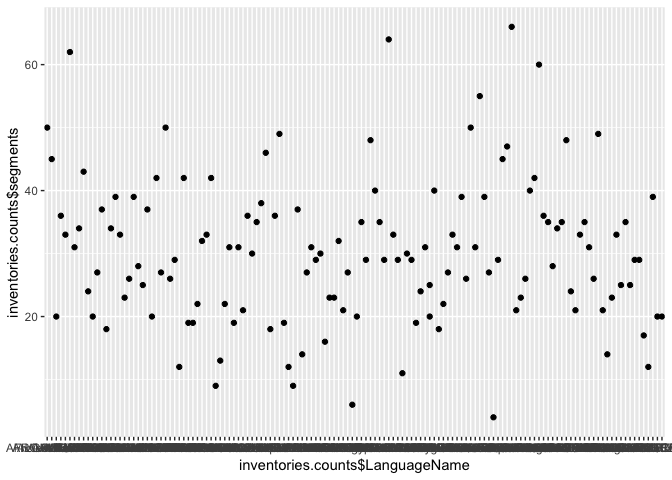
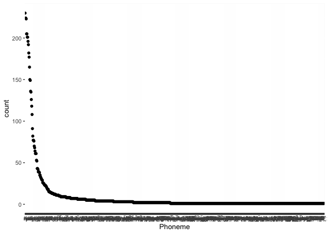
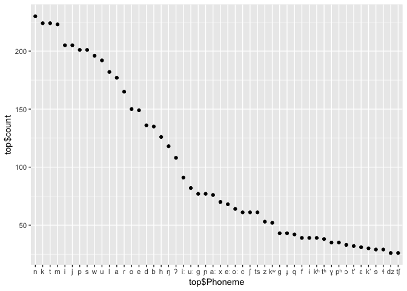

BDPROTO stats
================
Steven Moran

``` r
library(dplyr)
library(ggplot2)
```

``` r
load(file='../bdproto.Rdata')
glimpse(inventories)
```

    ## Observations: 4,138
    ## Variables: 61
    ## $ BdprotoID              <int> 1061, 1061, 1061, 1061, 1061, 1061, 106...
    ## $ LanguageName           <chr> "AFRO-ASIATIC", "AFRO-ASIATIC", "AFRO-A...
    ## $ LanguageFamily         <chr> "Afro-Asiatic", "Afro-Asiatic", "Afro-A...
    ## $ Phoneme                <chr> "ʕ", "ʔ", "ħ", "ŋ", "ŋʷ", "ʃ", "a", "aː...
    ## $ Glottocode             <chr> "afro1255", "afro1255", "afro1255", "af...
    ## $ LanguageFamilyRoot     <chr> "afas", "afas", "afas", "afas", "afas",...
    ## $ Classification         <chr> "Afro-Asiatic", "Afro-Asiatic", "Afro-A...
    ## $ TimeDepth              <chr> "9th-8th millenia B.C. (diakonoff1988af...
    ## $ TimeDepthYBP           <int> 10000, 10000, 10000, 10000, 10000, 1000...
    ## $ Homeland               <chr> "", "", "", "", "", "", "", "", "", "",...
    ## $ HomelandSource         <chr> "", "", "", "", "", "", "", "", "", "",...
    ## $ Url                    <chr> "http://www.diadm.ish-lyon.cnrs.fr/upsi...
    ## $ FileName               <chr> "LG1061.txt", "LG1061.txt", "LG1061.txt...
    ## $ MetadataNotes          <chr> "", "", "", "", "", "", "", "", "", "",...
    ## $ BibtexKey              <chr> "ehret1995reconstructing", "ehret1995re...
    ## $ Source                 <chr> "BDPROTO", "BDPROTO", "BDPROTO", "BDPRO...
    ## $ PhonemeNotes           <chr> NA, NA, NA, NA, NA, NA, NA, NA, NA, NA,...
    ## $ Allophone              <chr> NA, NA, NA, NA, NA, NA, NA, NA, NA, NA,...
    ## $ AllophoneNotes         <chr> NA, NA, NA, NA, NA, NA, NA, NA, NA, NA,...
    ## $ SpecificDialect        <chr> NA, NA, NA, NA, NA, NA, NA, NA, NA, NA,...
    ## $ LanguageCode           <chr> NA, NA, NA, NA, NA, NA, NA, NA, NA, NA,...
    ## $ SyllableStructure      <chr> NA, NA, NA, NA, NA, NA, NA, NA, NA, NA,...
    ## $ SyllableStructureNotes <chr> NA, NA, NA, NA, NA, NA, NA, NA, NA, NA,...
    ## $ PhonologyNotes         <chr> NA, NA, NA, NA, NA, NA, NA, NA, NA, NA,...
    ## $ tone                   <chr> "0", "0", "0", "0", "0", "0", "0", "0",...
    ## $ stress                 <chr> "-", "-", "-", "-", "-", "-", "-", "-",...
    ## $ syllabic               <chr> "-", "-", "-", "-", "-", "-", "+", "+",...
    ## $ short                  <chr> "-", "-", "-", "-", "-", "-", "-", "-",...
    ## $ long                   <chr> "-", "-", "-", "-", "-", "-", "-", "+",...
    ## $ consonantal            <chr> "+", "+", "+", "+", "+", "+", "-", "-",...
    ## $ sonorant               <chr> "-", "-", "-", "+", "+", "-", "+", "+",...
    ## $ continuant             <chr> "+", "-", "+", "-", "-", "+", "+", "+",...
    ## $ delayedRelease         <chr> "+", "-", "+", "0", "0", "+", "0", "0",...
    ## $ approximant            <chr> "-", "-", "-", "-", "-", "-", "+", "+",...
    ## $ tap                    <chr> "-", "-", "-", "-", "-", "-", "-", "-",...
    ## $ trill                  <chr> "-", "-", "-", "-", "-", "-", "-", "-",...
    ## $ nasal                  <chr> "-", "-", "-", "+", "+", "-", "-", "-",...
    ## $ lateral                <chr> "-", "-", "-", "-", "-", "-", "-", "-",...
    ## $ labial                 <chr> "-", "-", "-", "-", "+", "-", "-", "-",...
    ## $ round                  <chr> "0", "0", "0", "0", "+", "0", "0", "0",...
    ## $ labiodental            <chr> "0", "0", "0", "0", "0", "0", "0", "0",...
    ## $ coronal                <chr> "-", "-", "-", "-", "-", "+", "-", "-",...
    ## $ anterior               <chr> "0", "0", "0", "0", "0", "-", "0", "0",...
    ## $ distributed            <chr> "0", "0", "0", "0", "0", "+", "0", "0",...
    ## $ strident               <chr> "0", "0", "0", "0", "0", "+", "0", "0",...
    ## $ dorsal                 <chr> "+", "-", "+", "+", "+", "-", "+", "+",...
    ## $ high                   <chr> "-", "0", "-", "+", "+", "0", "-", "-",...
    ## $ low                    <chr> "+", "0", "+", "-", "-", "0", "+", "+",...
    ## $ front                  <chr> "-", "0", "-", "-", "-", "0", "-", "-",...
    ## $ back                   <chr> "+", "0", "+", "-", "-", "0", "-", "-",...
    ## $ tense                  <chr> "0", "0", "0", "0", "0", "0", "0", "0",...
    ## $ retractedTongueRoot    <chr> "0", "0", "0", "0", "0", "0", "-", "-",...
    ## $ advancedTongueRoot     <chr> "0", "0", "0", "0", "0", "0", "-", "-",...
    ## $ periodicGlottalSource  <chr> "+", "-", "-", "+", "+", "-", "+", "+",...
    ## $ epilaryngealSource     <chr> "-", "-", "-", "-", "-", "-", "-", "-",...
    ## $ spreadGlottis          <chr> "-", "-", "-", "-", "-", "-", "-", "-",...
    ## $ constrictedGlottis     <chr> "-", "+", "-", "-", "-", "-", "-", "-",...
    ## $ fortis                 <chr> "-", "-", "-", "-", "-", "-", "0", "0",...
    ## $ raisedLarynxEjective   <chr> "-", "-", "-", "-", "-", "-", "-", "-",...
    ## $ loweredLarynxImplosive <chr> "-", "-", "-", "-", "-", "-", "-", "-",...
    ## $ click                  <chr> "-", "-", "-", "-", "-", "-", "0", "0",...

``` r
# How many inventories are there?
nrow(inventories %>% select(BdprotoID) %>% unique())
```

    ## [1] 137

``` r
# How many distinct Glottocodes are there?
bdproto.glottocodes <- inventories %>% select(Glottocode) %>% unique()
nrow(bdproto.glottocodes)
```

    ## [1] 122

``` r
# How many are NA?
x <- as.data.frame(inventories %>% select(BdprotoID, Glottocode) %>% distinct())
sum(is.na(x$Glottocode))
```

    ## [1] 9

``` r
# Get the Glottolog family IDs -- this doesn't do much because language families don't have latitude, longitude, area, etc.
glottolog <- read.csv('glottolog_languoid.csv/languoid.csv', header=T, stringsAsFactors = F)
glottlog.families <- glottolog %>% select(family_id) %>% distinct()
```

``` r
# How many BDPROTO Glottocodes are in the Glottolog top-level language family trees?
table(bdproto.glottocodes$Glottocode %in% glottlog.families$family_id)
```

    ## 
    ## FALSE  TRUE 
    ##    84    38

``` r
# Which ones?
bdproto.in.glottolog <- bdproto.glottocodes[which(bdproto.glottocodes$Glottocode %in% glottlog.families$family_id), ]
bdproto.in.glottolog
```

    ## # A tibble: 38 x 1
    ##    Glottocode
    ##    <chr>     
    ##  1 afro1255  
    ##  2 araw1281  
    ##  3 atha1245  
    ##  4 aust1307  
    ##  5 chib1249  
    ##  6 chim1311  
    ##  7 chuk1271  
    ##  8 drav1251  
    ##  9 eski1264  
    ## 10 guah1252  
    ## # ... with 28 more rows

``` r
# How many segments do the proto-languages have?
inventories.counts <- inventories %>% select(BdprotoID, LanguageName) %>% group_by(BdprotoID, LanguageName) %>% summarize(segments=n()) %>% arrange(desc(segments))
inventories.counts
```

    ## # A tibble: 137 x 3
    ## # Groups:   BdprotoID [137]
    ##    BdprotoID LanguageName          segments
    ##        <int> <chr>                    <int>
    ##  1      1003 PROTO-LAKKIA                66
    ##  2        31 Old South Arabic            64
    ##  3        18 Ancient North Arabian       62
    ##  4         6 Proto-Tai                   60
    ##  5        14 Proto-Dené–Caucasian        55
    ##  6         1 Proto-Berber                50
    ##  7      1061 AFRO-ASIATIC                50
    ##  8      1062 CUSHITIC                    50
    ##  9      1067 TAI                         49
    ## 10      1109 KERESAN                     49
    ## # ... with 127 more rows

``` r
summary(inventories.counts$segments)
```

    ##    Min. 1st Qu.  Median    Mean 3rd Qu.    Max. 
    ##     4.0    22.0    29.0    30.2    36.0    66.0

``` r
inventories.counts$BdprotoID <- factor(inventories.counts$BdprotoID, levels=inventories.counts$BdprotoID[order(-inventories.counts$segments)])
qplot(inventories.counts$LanguageName, inventories.counts$segments)
```



``` r
# What is the frequency of segments across the proto-languages?
segment.counts <- inventories %>% select(Phoneme) %>% group_by(Phoneme) %>% summarize(count=n()) %>% arrange(desc(count)) %>% filter(!is.na(Phoneme))
dim(segment.counts)
```

    ## [1] 478   2

``` r
head(segment.counts)
```

    ## # A tibble: 6 x 2
    ##   Phoneme count
    ##   <chr>   <int>
    ## 1 i         125
    ## 2 n         124
    ## 3 u         124
    ## 4 k         123
    ## 5 m         123
    ## 6 t         121

``` r
segment.counts$Phoneme <- factor(segment.counts$Phoneme, levels=segment.counts$Phoneme[order(-segment.counts$count)])
ggplot(segment.counts, aes(x=Phoneme, y=count))+
  geom_point() + 
  ylab('count') +
  xlab('Phoneme')
```



``` r
# Plot just the top 50 most frequent segments in BSD
top <- head(segment.counts, n=50)
qplot(top$Phoneme, top$count)
```



<!--
########################################################
# Merge results in segments with NA for feature values #
########################################################
inventories %>% dplyr::filter(is.na(consonantal)) %>% select(ID, Name, Glottocode) %>% unique()
missing.segments <- inventories %>% filter(is.na(consonantal)) %>% select(Phoneme) %>% unique()
write.table(missing.segments, "missing-segments.csv", sep="\t", quote = F, row.names = F)

# There are 36 languages that have one or more missing feature vectors.
dim(inventories %>% filter(is.na(consonantal)) %>% select(ID, Name) %>% unique())
no.feature.vectors <- anti_join(inventories, features)
no.feature.vectors <- no.feature.vectors %>% select(ID, Name, Phoneme, Source) %>% arrange(Name) %>% arrange(ID)
nrow(no.feature.vectors) # 91 feature vectors missing (with duplicates)
dim(no.feature.vectors %>% distinct(LanguageName)) # 36 distinct segments
head(no.feature.vectors)
-->
