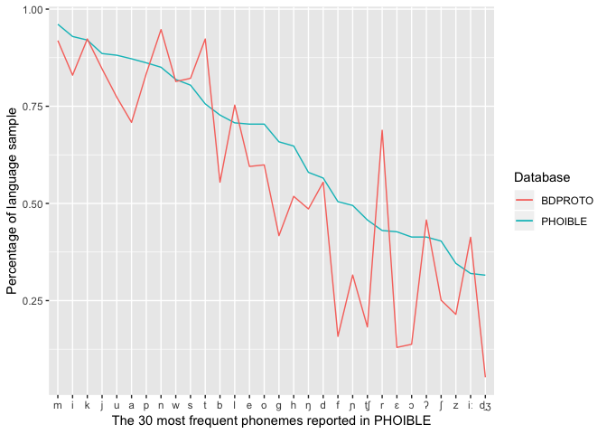
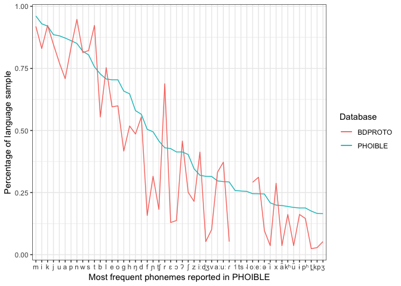

BDPROTO descriptive stats
================
Steven Moran

``` r
library(dplyr)
library(ggplot2)
```

``` r
# Load the current BDPROTO data
load(file='../bdproto.Rdata')
```

``` r
# How many total inventories are there?
nrow(inventories %>% select(BdprotoID) %>% unique())
```

    ## [1] 257

``` r
# This is just the inventories for which there are consonants and voewls present.
inventories.pure <- inventories %>% filter(is.na(InventoryType))
```

``` r
library(xtable)
# Select subset for display for BDPROTO paper
# display <- inventories %>% select(BdprotoID, LanguageName, Glottocode, Phoneme, LanguageFamily, TimeDepthYBP) %>% arrange(BdprotoID)
# xtable(head(display, n=100))
```

``` r
# An example of the output
# display <- inventories %>% select(BdprotoID, Phoneme, labial, coronal, consonantal) %>% arrange(BdprotoID)
# xtable(head(display))
```

``` r
# How many data points per source are there?
sources <- inventories %>% select(BdprotoID, LanguageName, Source) %>% 
  group_by(BdprotoID, LanguageName, Source) %>% distinct()
table(sources$Source)
```

    ## 
    ##     ANE BDPROTO    HUJI      UZ 
    ##      21     101     120      15

``` r
# How many unique phonemes are there? Some of these will have to be cleaned up, so the figure will be lower.
nrow(inventories %>% select(Phoneme) %>% group_by(Phoneme) %>% distinct())
```

    ## [1] 794

``` r
# How many language families have we tagged?
nrow(inventories %>% select(LanguageFamily) %>% group_by(LanguageFamily) %>% distinct())
```

    ## [1] 124

``` r
# How many distinct data points are there?
x <- inventories %>% select(BdprotoID, LanguageName, Glottocode, Duplicate) %>% unique() %>% arrange(LanguageName)
table(x$Duplicate)
```

    ## 
    ## FALSE  TRUE 
    ##   178    79

``` r
# That is, there are 178 independent data points and 79 duplicated ones. Through manual inspection, we identified 3 sets of duplicates (9 data points), and the rest are doubles. This mean 70/2=25 + 3 + 178 = **206 unique language data points**.
```

``` r
# How many distinct Glottocodes are there? Some are NA (don't exist, e.g. Altaic) and others have not yet been identified.
bdproto.glottocodes <- inventories %>% select(Glottocode) %>% unique()
nrow(bdproto.glottocodes) # 188
```

    ## [1] 188

``` r
# How Glottocodes are NA (i.e. we know there exists no Glottocode at the moment)?
# inventories %>% group_by(BdprotoID, Glottocode) %>% select(BdprotoID, Glottocode) %>% distinct() %>% filter(n()<1)
x <- as.data.frame(inventories %>% select(BdprotoID, Glottocode) %>% distinct())
table(x$Glottocode=="") # 22
```

    ## 
    ## FALSE  TRUE 
    ##   224    22

``` r
table(x$Glottocode=="", exclude=F) # 11 NA
```

    ## 
    ## TRUE <NA> 
    ##   22   11

``` r
# 224 + 22 + 11 = 257
```

``` r
# Get the Glottolog family IDs -- this doesn't do much because language families don't have latitude, longitude, area, etc.
glottolog <- read.csv('glottolog_languoid.csv/languoid.csv', header=T, stringsAsFactors = F)
glottlog.families <- glottolog %>% select(family_id) %>% distinct()
```

``` r
# How many BDPROTO Glottocodes are in the Glottolog top-level language family trees?
table(bdproto.glottocodes$Glottocode %in% glottlog.families$family_id)
```

    ## 
    ## FALSE  TRUE 
    ##   132    56

``` r
# Which ones?
bdproto.in.glottolog <- bdproto.glottocodes[which(bdproto.glottocodes$Glottocode %in% glottlog.families$family_id), ]
head(bdproto.in.glottolog)
```

    ## # A tibble: 6 x 1
    ##   Glottocode
    ##   <chr>     
    ## 1 afro1255  
    ## 2 araw1281  
    ## 3 aust1307  
    ## 4 chib1249  
    ## 5 chim1311  
    ## 6 chuk1271

``` r
# How many segments do the proto-languages have?
# Note some inventories only have consonant or vowel inventories specified (`InventoryType` field)
inventories.counts <- inventories %>% select(BdprotoID, LanguageName, InventoryType) %>% group_by(BdprotoID, LanguageName, InventoryType) %>% summarize(segments=n()) %>% arrange(segments)
dim(inventories.counts)
```

    ## [1] 257   4

``` r
# Drop consonant and vowel only inventories (currently 10 data points)
inventories.counts.pure <- inventories.counts %>% filter(is.na(InventoryType))
dim(inventories.counts.pure)
```

    ## [1] 247   4

``` r
# What is the median and mean number of segments in the sample (for full consonant and vowel inventories)?
summary(inventories.counts.pure$segments)
```

    ##    Min. 1st Qu.  Median    Mean 3rd Qu.    Max. 
    ##   11.00   23.00   29.00   30.35   36.00   89.00

``` r
# All segment types (TODO: fix the NAs)
table(inventories$type, exclude=F)
```

    ## 
    ##    C    V <NA> 
    ## 5495 2125   22

``` r
# Get consonant counts and stats of ALL inventories
inventories.consonants <- inventories %>% filter(is.na(InventoryType) | InventoryType=="consonants") %>% filter(Source!="ANE") 
table(inventories.consonants$InventoryType, exclude=F)
```

    ## 
    ## consonants       <NA> 
    ##        103       6831

``` r
# Get the consonant counts per inventory (252 data points)
c.counts <- inventories.consonants %>% select(BdprotoID, Phoneme, type) %>% filter(type=="C") %>%  group_by(BdprotoID) %>% summarize(consonants = n())

summary(c.counts$consonants)
```

    ##    Min. 1st Qu.  Median    Mean 3rd Qu.    Max. 
    ##    5.00   15.00   19.00   21.48   26.00   69.00

``` r
# Get consonant counts and stats of original BDPROTO
og.bdproto.cs <- inventories %>% filter(is.na(InventoryType) | InventoryType=="consonants") %>% filter(Source=="BDPROTO")

# Get the consonant counts per inventory (252 data points)
og.c.counts <- og.bdproto.cs %>% select(BdprotoID, Phoneme, type) %>% filter(type=="C") %>% group_by(BdprotoID) %>% summarize(consonants = n())

summary(og.c.counts$consonants)
```

    ##    Min. 1st Qu.  Median    Mean 3rd Qu.    Max. 
    ##    5.00   15.75   19.00   21.00   26.25   42.00

``` r
# Get vowel counts and stats of ALL inventories
inventories.vowels <- inventories %>% filter(is.na(InventoryType) | InventoryType=="vowels") %>% filter(Source!="ANE")
table(inventories.vowels$InventoryType, exclude=F)
```

    ## 
    ## vowels   <NA> 
    ##     42   6831

``` r
# Get the vowel counts per inventory (should be 252 data points)
v.counts <- inventories.vowels %>% select(BdprotoID, Phoneme, type) %>% filter(type=="V") %>% group_by(BdprotoID) %>% summarize(vowels = n())

summary(v.counts$vowels)
```

    ##    Min. 1st Qu.  Median    Mean 3rd Qu.    Max. 
    ##   2.000   6.000  10.000   9.905  13.000  29.000

``` r
# Get vowel counts and stats of original BDPROTO
og.bdproto.vs <- inventories %>% filter(is.na(InventoryType) | InventoryType=="vowels") %>% filter(Source=="BDPROTO")

# Get the consonant counts per inventory (252 data points)
og.v.counts <- og.bdproto.vs %>% select(BdprotoID, Phoneme, type) %>% filter(type=="V") %>% group_by(BdprotoID) %>% summarize(vowels = n())

summary(og.v.counts$vowels)
```

    ##    Min. 1st Qu.  Median    Mean 3rd Qu.    Max. 
    ##   3.000   6.000   8.000   9.097  12.000  29.000

``` r
# Plot segment counts (all inventories)
inventories.counts$BdprotoID <- factor(inventories.counts$BdprotoID, levels=inventories.counts$BdprotoID[order(-inventories.counts$segments)])
# qplot(inventories.counts$LanguageName, inventories.counts$segments)
```

``` r
# What is the frequency of segments across the proto-languages? Use only full inventories (inventories.pure)
segment.counts <- inventories.pure %>% select(Phoneme) %>% group_by(Phoneme) %>% summarize(count=n()) %>% arrange(desc(count)) %>% filter(!is.na(Phoneme))
dim(segment.counts)
```

    ## [1] 784   2

``` r
head(segment.counts)
```

    ## # A tibble: 6 x 2
    ##   Phoneme count
    ##   <chr>   <int>
    ## 1 n         234
    ## 2 k         228
    ## 3 t         228
    ## 4 m         227
    ## 5 j         209
    ## 6 p         206

``` r
# Get percentages
total.inventories <- nrow(inventories.pure %>% select(BdprotoID) %>% distinct())
segment.counts$Percentage <- segment.counts$count/total.inventories

# Plot it
# segment.counts$Phoneme <- factor(segment.counts$Phoneme, levels=segment.counts$Phoneme[order(-segment.counts$count)])
# ggplot(segment.counts, aes(x=Phoneme, y=count))+
#  geom_point() + 
#  ylab('count') +
#  xlab('Phoneme')
```

``` r
# Plot just the top 50 most frequent segments
top <- head(segment.counts, n=50)
# qplot(top$Phoneme, top$count)
# qplot(top$Phoneme, top$Percentage)
```

``` r
# Get phoible phonemes for comparison
load(url('https://github.com/phoible/dev/blob/master/data/phoible-by-phoneme.RData?raw=true'))

# Get unique inventories
phoible <- final.data %>% filter(Trump)

# Get number of unique inventories
num.phoible.inventories <- nrow(phoible %>% select(InventoryID) %>% distinct())

# TODO
# library(testthat)
# expect_that(dim(final.data) < dim(phoible))
rm(final.data)

# Get phoneme counts and percentages
phoible.phonemes <- phoible %>% select(InventoryID, Phoneme) %>% group_by(Phoneme) %>% summarize(count=n()) %>% arrange(desc(count))
phoible.phonemes$Percentage <- phoible.phonemes$count/num.phoible.inventories
head(phoible.phonemes)
```

    ## # A tibble: 6 x 3
    ##   Phoneme count Percentage
    ##   <chr>   <int>      <dbl>
    ## 1 m        1773      0.961
    ## 2 i        1715      0.930
    ## 3 k        1698      0.920
    ## 4 j        1634      0.886
    ## 5 u        1626      0.881
    ## 6 a        1609      0.872

``` r
phoible.phonemes$Phoneme <- factor(phoible.phonemes$Phoneme, levels=phoible.phonemes$Phoneme[order(-phoible.phonemes$count)])
```

``` r
top.phoible <- head(phoible.phonemes, n=50)
qplot(top.phoible$Phoneme, top$count)
```


``` r
qplot(top.phoible$Phoneme, top$Percentage)
```


``` r
# Combine the phoneme counts to plot them together in one graph
x <- phoible.phonemes
colnames(x) <- c("Phoneme", "Phoible.count", "Phoible.percentage")
y <- segment.counts
colnames(y) <- c("Phoneme", "Bdproto.count", "Bdproto.percentage")
z <- left_join(x,y)
```

    ## Joining, by = "Phoneme"

    ## Warning: Column `Phoneme` joining factor and character vector, coercing
    ## into character vector

``` r
rm(x,y)

# Reorder phonemes as factor
z$Phoneme <- factor(z$Phoneme, levels=z$Phoneme[order(-z$Phoible.count)])
```

``` r
# Try top 30 phonemes
top.z <- head(z, n=30)

ggplot(data = top.z, aes(x = Phoneme, group=1)) +
  geom_line(aes(y = Phoible.percentage, color = "PHOIBLE")) + 
  geom_line(aes(y = Bdproto.percentage, color = "BDPROTO")) +
  ylab("Percentage of language sample") +
  xlab("The 30 most frequent phonemes reported in PHOIBLE") +
  labs(color="Database")
```



``` r
# Try top 50 phonemes
top.z <- head(z, n=50)

# Some phonemes occur very rarely in BDPROTO (or not at all) compared to PHOIBLE, e.g. /ts/ occurs at 2.5%. High tone not at all.
top.z %>% filter(Phoneme=="ts")
```

    ## # A tibble: 1 x 5
    ##   Phoneme Phoible.count Phoible.percentage Bdproto.count Bdproto.percentage
    ##   <fct>           <int>              <dbl>         <int>              <dbl>
    ## 1 ts                473              0.256            61              0.247

``` r
top.z %>% filter(Phoneme=="˦")
```

    ## # A tibble: 1 x 5
    ##   Phoneme Phoible.count Phoible.percentage Bdproto.count Bdproto.percentage
    ##   <fct>           <int>              <dbl>         <int>              <dbl>
    ## 1 ˦                 477              0.259            NA                 NA

``` r
ggplot(data = top.z, aes(x = Phoneme, group=1)) +
  geom_line(aes(y = Phoible.percentage, color = "PHOIBLE")) + 
  geom_line(aes(y = Bdproto.percentage, color = "BDPROTO")) +
  ylab("Percentage of language sample") +
  xlab("The 50 most frequent phonemes reported in PHOIBLE") +
  labs(color="Database")
```



``` r
# Get dates
inventories.dates <- inventories.pure %>% select(BdprotoID, LanguageName, LanguageFamily, TimeDepthYBP) %>% group_by(BdprotoID, LanguageName, LanguageFamily, TimeDepthYBP) %>% distinct() %>% arrange(desc(TimeDepthYBP)) %>% filter(TimeDepthYBP < 10001)
```

<!-- 
########################################################
# Merge results in segments with NA for feature values #
########################################################
inventories %>% dplyr::filter(is.na(consonantal)) %>% select(ID, Name, Glottocode) %>% unique()
missing.segments <- inventories %>% filter(is.na(consonantal)) %>% select(Phoneme) %>% unique()
write.table(missing.segments, "missing-segments.csv", sep="\t", quote = F, row.names = F)

# There are 36 languages that have one or more missing feature vectors.
dim(inventories %>% filter(is.na(consonantal)) %>% select(ID, Name) %>% unique())
no.feature.vectors <- anti_join(inventories, features)
no.feature.vectors <- no.feature.vectors %>% select(ID, Name, Phoneme, Source) %>% arrange(Name) %>% arrange(ID)
nrow(no.feature.vectors) # 91 feature vectors missing (with duplicates)
dim(no.feature.vectors %>% distinct(LanguageName)) # 36 distinct segments
head(no.feature.vectors)
-->
